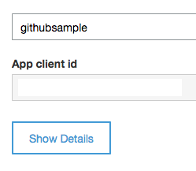
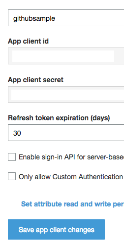
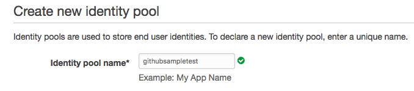
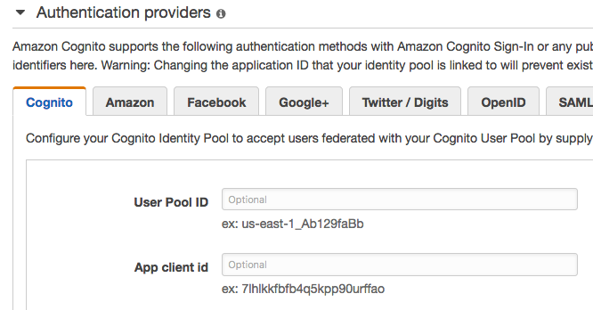

# Running AmazonKinesisVideoStreaming Sample

## 1. Create a user pool
  * Go to https://console.aws.amazon.com/cognito/
  * Click `Manage your User Pools`
  * Click `Create a user pool`
  * Fill-in `Pool name`
  * Click `Review defaults`
  * Click `Create user pool`
  * Copy `Pool Id` :clipboard:
  * Select `App clients` in the left nav.
  * Click `Add an app client`
  * Fill-in `App client name`
  * Click `Create app client`
  * Click `Show details` and copy `App client id` and `App client secret` :clipboard:
    *  `-->` 

## 2. Create an identity pool
  * Go to https://console.aws.amazon.com/cognito/
  * Click `Manage Federated Identities`
  * Click `Create new identity pool`
  * Fill-in `Identity pool name`
    * 
  * Under the heading `Authentication providers`, in the `Cognito` tab, fill-in the `User Pool Id` and `App client id` from the user pools step.
    
  * Click `Create create`
  * There will be details for 2 roles. Look at the one for `authenticated identities` and click `Edit` next to the policy document and your policy should look like this:
    ```
    {
        "Version": "2012-10-17",
        "Statement": [
          {
            "Effect": "Allow",
            "Action": [
              "cognito-identity:*",
              "kinesisvideo:*"
            ],
            "Resource": [
              "*"
            ]
          }
        ]
      }
    ```
  * Click `Allow`
  * Copy the `Identity Pool Id` from the code snippets on the screen. :clipboard:

## 3. Paste
  * You will need all the information from the above steps that have :clipboard: and paste them into this file on your local copy [awsconfiguration.json](src/main/res/raw/awsconfiguration.json)
  * Change the region that the app will stream to by editing the `KINESIS_VIDEO_REGION` constant in your local copy of [KinesisVideoDemoApp.java](https://github.com/awslabs/aws-sdk-android-samples/blob/master/AmazonKinesisVideoDemoApp/src/main/java/com/amazonaws/kinesisvideo/demoapp/KinesisVideoDemoApp.java)
