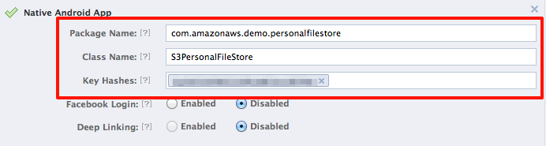

##Running the Amazon S3 Personal File Store Sample with Web Identity Federation

This *Amazon S3 Personal File Store* sample is fully detailed in the [web identity federation](http://aws.amazon.com/articles/4617974389850313) article.  The sample demonstrates how to use AWS Security Token Service (STS) to give application users specific and constrained permissions to an Amazon S3 bucket.  Each application user will get a "folder" of an Amazon S3 bucket as specified by the role policy.  This README details all the steps necessary to get the sample fully running:
###1. Create a Facebook application

1. Sign up for the Facebook developer program at [developers.facebook.com](https://developers.facebook.com/). **Note:** You will need to be signed in with your Facebook account in order to register for the developer program.

2. Visit the guide [Getting Started with the Facebook SDK for Android](https://developers.facebook.com/docs/getting-started/facebook-sdk-for-android/3.0/) and follow the instructions to **Create a Facebook App**. Make note of your `App ID`. You'll use it in configuring the sample. The other steps in this guide will be useful with your future Facebook Apps, but are not necessary for this sample. 
	
	
3. You may enter any reasonable values under **Basic Info**. These will not affect the integration between the sample and Facebook.

4. Under **Select how your app integrates with Facebook**, select **Native Android App**.
	
	
5. Enter the following for *Package Name*: `com.amazonaws.demo.personalfilestore`

6. Enter the following for *Class Name*: `S3PersonalFileStore`

7. Enter the appropriate value for your environment in **Key Hashes**.
	

###2. Create the AWS Resources

You can **automate** the creation of AWS Resources or create them **manually**. **Skip** to step 3 for creating the resources **manually**.

[AWS CloudFormation](https://console.aws.amazon.com/cloudformation/home) can be used to **automate** the creation and deletion of the resources specified steps 3 and 4. 

1. Follow the [instructions](https://mobile.awsblog.com/post/Tx3ILZHIKNTQQ83/Simplify-Web-Identity-Federation-Setup-with-AWS-CloudFormation) on how to use [CloudFormation](https://console.aws.amazon.com/cloudformation/home) for Web Identity Federation setup for this app.
2. Once the stack is created **succesfully** you will get the S3 Bucket Name and User Role ARN required in later steps. **Skip to step 5**.

###3. Create an Amazon S3 bucket to use for the sample.

**Skip to step 5 if you have already created S3 bucket and user role using the instructions in step 2.**

Using the [AWS Management Console] create a **new** Amazon S3 bucket for testing with this sample.  The name you choose for the bucket is necessary for a number of steps to follow.

###4. Create your Role for web identity federation

1. Visit the [AWS Management Console](https://console.aws.amazon.com/iam/home) to create a **new** role.
	
	
2. Give your role a meaningful name, such as `FBWIFS3FileStore`. 
	
	
3. Select **Role for Web Identity Provider Access** as your role type. 
	
	
4. Select Facebook as the **Identity Provider** and provide the application ID you generated with Facebook. 
	
	
5. Click Continue when prompted to verify the role trust policy.

6. Select **Custom Policy** when asked to set permissions. This allows us to enter our policy as JSON. 
	
	
7. Give the policy a name and enter the following JSON as the **Policy Document**, replacing `__BUCKET_NAME__` with the S3 bucket you created earlier:


	```
	{
	 "Version":"2012-10-17",
	 "Statement":[{
	   "Effect":"Allow",
	   "Action":["s3:ListBucket"],
	   "Resource":["arn:aws:s3:::__BUCKET_NAME__"],
	   "Condition":     {"StringLike":       {"s3:prefix":"${graph.facebook.com:id}/*"}
	     }
	  },
	  {
	   "Effect":"Allow",
	   "Action":["s3:GetObject", "s3:PutObject", "s3:DeleteObject"],
	   "Resource":[
	       "arn:aws:s3:::__BUCKET_NAME__/${graph.facebook.com:id}",
	       "arn:aws:s3:::__BUCKET_NAME__/${graph.facebook.com:id}/*"
	   ]
	  }
	 ]
	}
	```
	
8.  Review the information you entered and click **Create Role** to finish creating your role.
    
   
9.  Select the role and switch to the **Summary** tab. Take note of the **Role ARN**; you'll use it in configuring the sample.
    

###5. Import the sample and FacebookSDK

1. In Eclipse, select, *File*->*Import*. The Import Wizard will open.

2. Select *General*->*Existing Projects into Workspace*.  Click Next.

3. In Select root directory, browse to samples directory.  List of all samples projects will appear.

4. Select `AmazonS3PersonalFileStore`

5. Click Finish.

6. Download the `FacebookSDK` for Android [here](https://developers.facebook.com/docs/android/) **and** import the SDK into your workspace using the same process described above.

7. Next right click on the AmazonS3PersonalFileStore project and click *properties*, on the left hand column click *android*, and under Library click add.  Select the `FacebookSDK` in your workspace when prompted.  Click okay. Click Apply.

###6. Update sample configuration

1. Open the `res/values/strings.xml` file in Eclipse.

2. Enter the Amazon S3 bucket name, Facebook application ID, and role ARN where noted:

3. Open the `Login.java` class in the src and uncomment the code high lighted for Facebook login.

	```
	<string name="s3_bucket_name">BUCKET_NAME</string>
	<string name="fb_app_id">FACEBOOK_ID</string>
	<string name="fb_role_arn">ROLE_ARN</string>
	```

###7. Run the sample

1. Run the sample on your emulator or device.

2. You may want to install the Facebook application on your emulator or device to see the native login experience.